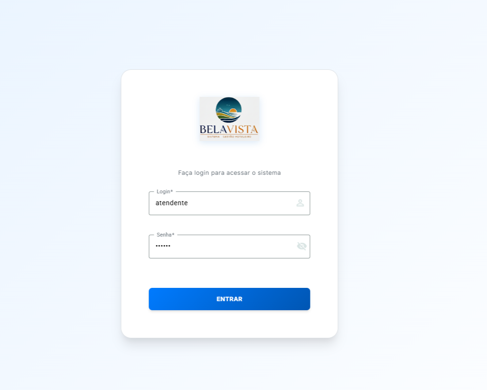
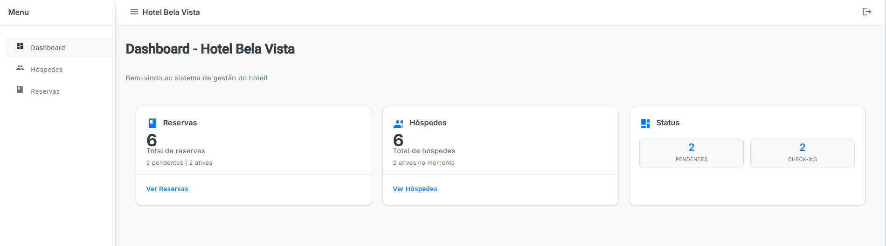
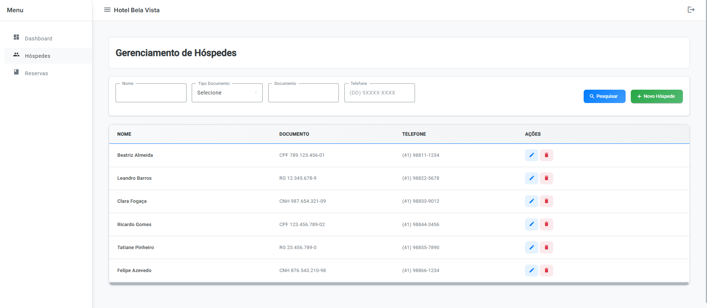
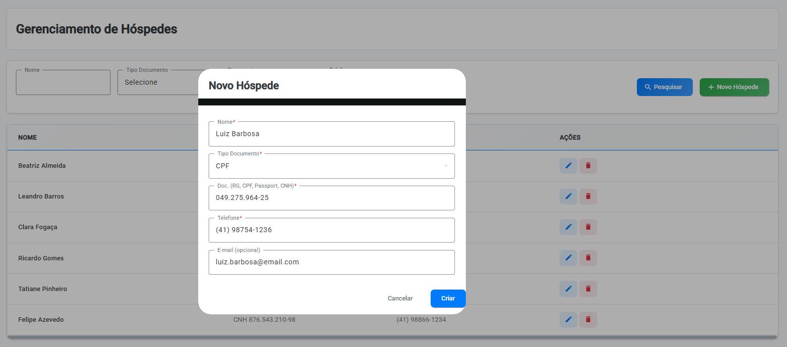
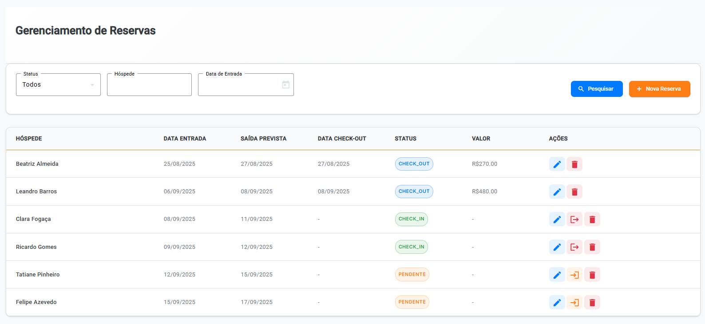
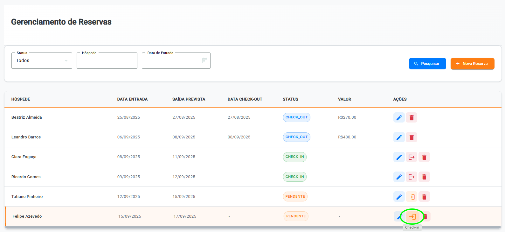
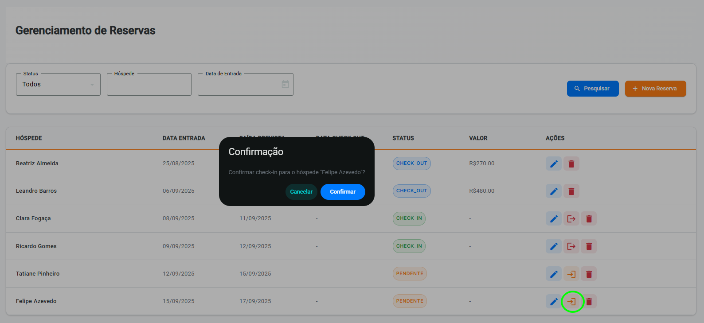
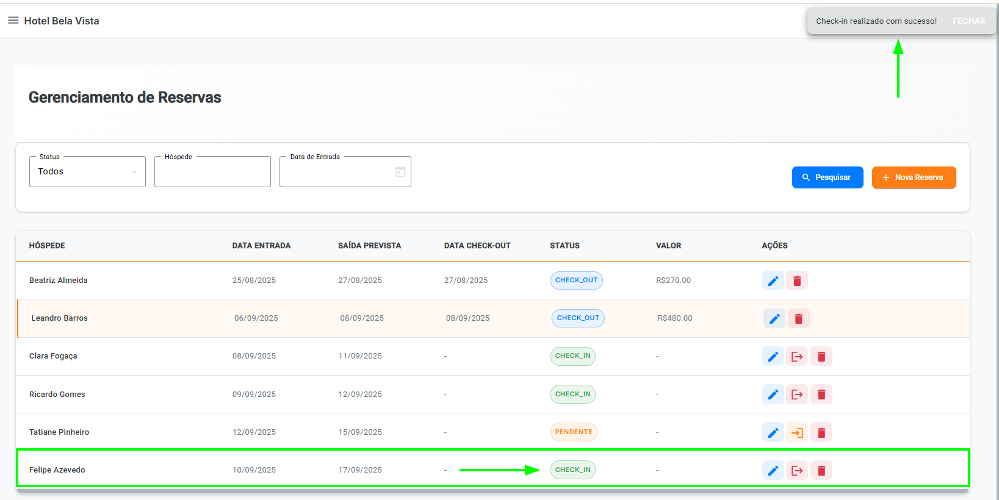
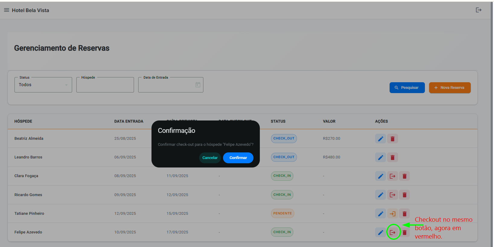
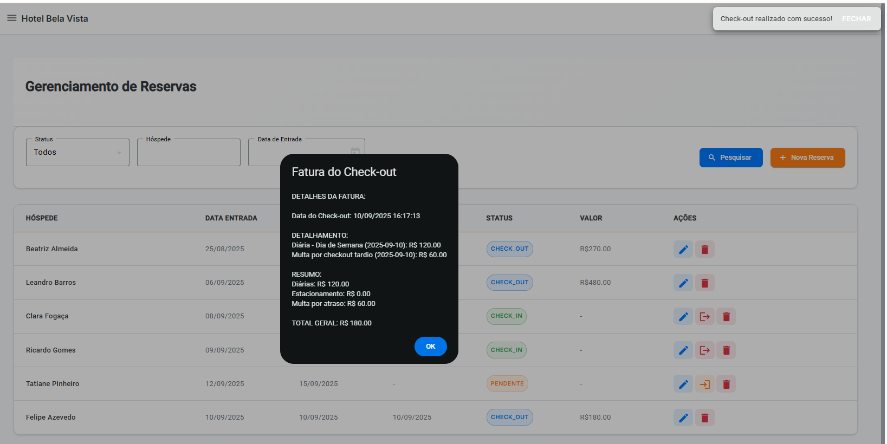

# 🏨 Belavista Frontend

Sistema de Gerenciamento Hoteleiro desenvolvido em Angular 18 com Material Design.

## 📚 Sumário

- [🚀 Visão Geral](#-visão-geral)
- [⚡ Funcionalidades](#-funcionalidades)
- [🛠 Tecnologias](#-tecnologias)
- [📋 Pré-requisitos](#-pré-requisitos)
- [🔧 Instalação](#-instalação)
- [📁 Estrutura](#-estrutura)
- [🔑 Configuração](#-configuração)
  - [🔐 Variáveis de Ambiente](#variáveis-de-ambiente)
- [📋 Gerenciamento de Documentos](#-gerenciamento-de-documentos)
  - [📄 Tipos de Documento Suportados](#tipos-de-documento-suportados)
- [📜 Scripts](#-scripts)
- [🚀 Endpoints da API](#-endpoints-da-api)
- [🖼️ Telas de Produção](#-telas-de-produção)


## 🚀 Visão Geral

Aplicação web para gerenciamento hoteleiro com interface moderna e responsiva. Inclui autenticação JWT, dashboard em tempo real e gerenciamento de hóspedes.

## ⚡ Funcionalidades

- 🔐 **Login seguro** com JWT
- 📊 **Dashboard** com métricas do hotel
- 👥 **Gerenciamento de hóspedes** com busca
  - 📄 **Tipos de documento suportados**: RG, CPF, PASSPORT, CNH
- 🎨 **Interface responsiva** Material Design
- 🛡️ **Rotas protegidas** com guards

## 🛠 Tecnologias

- **Angular 18** - Framework principal
- **Angular Material** - Componentes UI
- **TypeScript** - Linguagem
- **RxJS** - Programação reativa
- **SCSS** - Estilos

## 📋 Pré-requisitos

- Node.js 18+
- npm 9+
- Angular CLI 18+
- API Spring Boot rodando em `http://localhost:8080`

## 🔧 Instalação

```bash
# Clonar repositório
git clone https://github.com/cabralbrcwb/belavista-frontend.git
cd belavista-frontend

# Instalar dependências
npm install

# Executar aplicação
npm start
```

A aplicação estará disponível em `http://localhost:4200/`.

## 📁 Estrutura

```text
src/app/
├── core/                    # Serviços principais
│   ├── guards/             # Proteção de rotas
│   ├── interceptors/       # HTTP interceptors
│   ├── layout/             # Layout principal
│   └── services/           # Serviços de autenticação
├── features/               # Funcionalidades
│   ├── login/             # Tela de login
│   ├── dashboard/         # Dashboard
│   └── hospedes/          # Gerenciamento de hóspedes
└── shared/                # Componentes compartilhados
```

## 🔑 Configuração

### Variáveis de Ambiente

Criar `src/environments/environment.ts`:

```typescript
export const environment = {
  production: false,
  apiUrl: 'http://localhost:8080/api'
};
```

<<<<<<< HEAD
=======


>>>>>>> 615affc2f5eb40451493985438b18c8f06ec8378
## 📋 Gerenciamento de Documentos

### Tipos de Documento Suportados

O sistema suporta os seguintes tipos de documento para cadastro de hóspedes:

- **RG** - Registro Geral
- **CPF** - Cadastro de Pessoa Física
- **PASSPORT** - Passaporte
- **CNH** - Carteira Nacional de Habilitação

O campo de documento na interface é exibido como "DOC. (RG, CPF, PASSPORT, CNH)" para orientar o usuário sobre os tipos aceitos.

## 📜 Scripts

```bash
npm start          # Servidor desenvolvimento
npm run build      # Build produção
npm test           # Testes unitários
npm run lint       # Verificar código
```

<<<<<<< HEAD
=======


>>>>>>> 615affc2f5eb40451493985438b18c8f06ec8378
## 🚀 Endpoints da API

A seguir, a lista de endpoints disponíveis na aplicação.

### 🧍‍♂️ Módulo de Hóspedes

| Método | Endpoint | Descrição |
| :--- | :--- | :--- |
| `POST` | `/api/hospedes` | Cria um novo hóspede. Requer um corpo de requisição com os dados do hóspede. |
| `GET` | `/api/hospedes` | Lista todos os hóspedes ou busca por `nome`, `documento`, ou `telefone`. |
| `GET` | `/api/hospedes/{id}` | Busca um hóspede específico pelo seu ID. |
| `PUT` | `/api/hospedes/{id}` | Atualiza os dados de um hóspede existente. |
| `DELETE` | `/api/hospedes/{id}` | Remove um hóspede. A operação é bloqueada se o hóspede tiver reservas ativas. |

### 🛏️ Módulo de Reservas

| Método | Endpoint | Descrição |
| :--- | :--- | :--- |
| `POST` | `/api/reservas` | Cria uma nova reserva para um hóspede. Requer o ID do hóspede e as datas de entrada/saída. |
| `POST` | `/api/reservas/{id}/check-in` | Realiza o check-in de uma reserva `PENDENTE`. |
| `POST` | `/api/reservas/{id}/check-out` | Realiza o check-out de uma reserva com status `CHECK_IN` e retorna a fatura detalhada. |
| `GET` | `/api/reservas` | Lista todas as reservas ou filtra por status (`PENDENTE`, `CHECK_IN`, `CHECK_OUT`, `CANCELADA`). |
| `DELETE` | `/api/reservas/{id}` | Cancela uma reserva que ainda está com o status `PENDENTE`. |

<<<<<<< HEAD
## 🖼️ Telas de Produção

Fluxo visual do sistema (tamanhos aproximados das telas reais, largura 1200px para boa legibilidade):

<!-- markdownlint-disable MD033 -->

### 1) Login

<div align="center">
  
</div>

### 2) Dashboard

<div align="center">
  
</div>

### 3) Listagem de Hóspedes

<div align="center">
  
</div>

### 4) Cadastro de Hóspedes

<div align="center">
  
</div>

### 5) Reservas (acesso ao módulo)

<div align="center">
  
</div>

### 6) Listagem de Reservas

<div align="center">
  
</div>

### 7) Check-in (sequência)

<div align="center">
  
</div>

<div align="center">
  
</div>

<div align="center">
  
</div>

### 8) Checkout (sequência)

<div align="center">
  
</div>

<div align="center">
  
</div>

<div align="center">
  
</div>

### 09) Listagem com valor atualizado

<div align="center">
  
</div>

<!-- markdownlint-enable MD033 -->

## 👨‍💻 Autor

Desenvolvido com ❤️ por **Daniel Silva**.
=======

### 👨‍💻 Autor

Desenvolvido com ❤️ por **Daniel Silva**.

>>>>>>> 615affc2f5eb40451493985438b18c8f06ec8378
